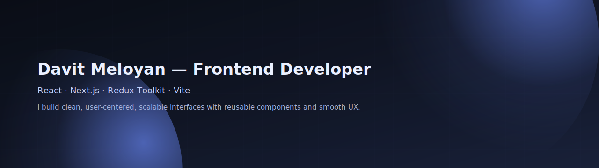

  

## 👋 Hey, I'm Davit
**Frontend Developer — React / Next.js**

I build clean, user-centered, and scalable web interfaces.  
I care about structure, reusability, smooth interaction flow, and clear visual hierarchy.

### 🚀 Tech Stack
- **JavaScript (ES6+)**, **TypeScript (learning)**
- **React.js**, **Next.js**
- **Redux**, **Redux Toolkit**
- **Vite.js**, Webpack (basic)
- **HTML5**, **CSS3**, **SASS/SCSS**, **Responsive UI**
- REST API (Fetch / Axios), Git & GitHub

### 🧩 What I Like Working On
- Reusable component architecture & design systems  
- Admin dashboards with real data  
- Authentication / role-based flows / CRUD  
- Clean UX that feels effortless

---

### 🛠️ Notable Projects

| Project | Description | Live |
|---|---|---|
| **Portfolio Website** | Next.js + SCSS personal site | https://davitmeloyan.syntaxacade.my/en |
| **Syntax Academe** | Programming academy platform UI | https://www.syntaxacade.my/en |
| **MovieNest** | Film & series explorer (API data) | https://www.movienest.live/ |
| **Games Hub** | Browser mini-games & interactions | https://games.syntaxacade.my/ |
| **Admin Dashboard (Private)** | Vite.js admin with Auth, Roles, CRUD | *Internal* |

---

### 📌 Current Focus
Deepening Next.js patterns, improving component composition, and writing clearer, more maintainable UI code.

### 📬 Contact
- **Portfolio:** https://davitmeloyan.syntaxacade.my/en  
- **GitHub:** https://github.com/davpage  
- **Telegram:** @davmeloyan

> *I enjoy building interfaces that feel smooth, clear, and meaningful to interact with.* 👨‍💻
